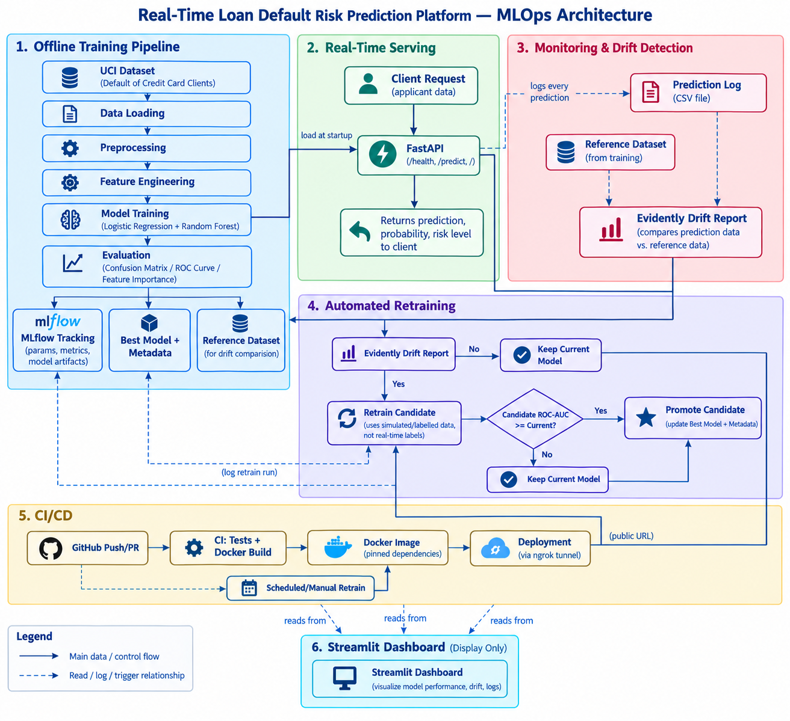

# Real-Time Loan Default Risk Prediction Platform

A production-style MLOps platform that predicts credit default risk in real time, with automated
model retraining, experiment tracking, and drift monitoring — built to simulate how modern enterprise
AI systems are developed and maintained.

## Overview

This project implements a complete, end-to-end MLOps lifecycle for a credit default risk model:

- **Real-time predictions** via a FastAPI REST API
- **Experiment tracking** with MLflow (parameters, metrics, model artifacts)
- **Data drift monitoring** with Evidently
- **Automated retraining** triggered by detected drift, with ROC-AUC-gated promotion
- **Containerized deployment** via Docker
- **CI/CD** via GitHub Actions (automated testing on every push/PR)
- **A monitoring dashboard** built with Streamlit

## Requirement Mapping

| Assignment Requirement | Implementation |
|---|---|
| Real-time predictions | FastAPI `/predict` endpoint |
| Automated model retraining | Drift-triggered retraining with ROC-AUC-gated promotion (`src/retrain.py`) |
| Continuous integration | GitHub Actions: automated testing + Docker build validation on every push/PR |
| Public deployment | Docker container exposed via ngrok tunnel |
| Experiment tracking | MLflow |
| Data drift monitoring | Evidently |
| CI/CD integration | GitHub Actions workflows (`ci.yml`, `retrain.yml`) |
| Monitoring dashboard | Streamlit |

*Note: with an ngrok-based deployment, this project delivers automated **CI** (testing + Docker
validation) rather than fully automatic **continuous deployment** — deploying a new build still
requires manually restarting the container/tunnel. This is documented transparently rather than
overstated.*

## System Workflow
Data → Preprocessing → Feature Engineering → Training → MLflow
→ Best Model → FastAPI → Predictions → Prediction Logs
→ Evidently Drift Detection → Retraining → Model Promotion (if candidate ≥ current)


## Prototype Limitations

| Limitation | Production Solution |
|---|---|
| Local file storage (MLflow, logs) | Persistent database / hosted MLflow server |
| ngrok tunnel (manual, non-persistent) | Managed cloud hosting service |
| Simulated/reused labels for retraining | Real labelled outcomes collected over time |


## Business Problem

Lenders need to assess credit default risk before extending or renewing credit, at a scale that
manual review can't match. This platform serves real-time risk predictions through an API, while
continuously monitoring incoming data for drift and automatically retraining a candidate model when
drift is detected — updating the production model only if the candidate is at least as good as the
current one.

## Technology Stack

| Component | Technology |
|---|---|
| Language | Python 3.13 |
| Dataset | UCI Default of Credit Card Clients |
| ML | scikit-learn (Logistic Regression, Random Forest) |
| Experiment Tracking | MLflow |
| API | FastAPI + Uvicorn |
| Drift Monitoring | Evidently |
| Dashboard | Streamlit |
| Containerization | Docker |
| CI/CD | GitHub Actions |
| Testing | Pytest |

## Architecture



Full explanation in [`docs/technical_documentation.md`](docs/technical_documentation.md).

## Folder Structure
loan-default-mlops-platform/
├── data/ # Raw, processed, reference, and monitoring data
├── models/ # Trained model, metrics, metadata
├── reports/ # Evaluation figures, drift reports, retrain summaries
├── notebooks/ # Exploratory data analysis
├── src/ # Core pipeline modules
├── api/ # FastAPI application
├── dashboard/ # Streamlit monitoring dashboard
├── tests/ # Pytest suite
├── .github/workflows/ # CI and scheduled retraining workflows
├── docs/ # Technical documentation + architecture diagram
├── Dockerfile
└── requirements.txt


## Getting Started

**1. Clone the repository and set up the environment:**
```bash
git clone https://github.com/Sandee96/loan-default-mlops-platform.git
cd loan-default-mlops-platform
python -m venv venv
venv\Scripts\activate        # Windows
pip install -r requirements.txt
```

**2. Run the full training pipeline:**
```bash
python -m src.pipeline
```
This loads the dataset, preprocesses it, engineers features, trains and evaluates two candidate
models, logs everything to MLflow, saves the best model, and creates a drift reference snapshot.

**3. Start the API:**
```bash
uvicorn api.main:app --reload
```
Visit `http://127.0.0.1:8000/` for the landing page, or `http://127.0.0.1:8000/docs` for interactive
Swagger testing.

**4. Start the monitoring dashboard:**
```bash
streamlit run dashboard/app.py
```

**5. View experiment tracking:**
```bash
mlflow ui
```

**6. Run the test suite:**
```bash
pytest -v
```

## API Reference

### `GET /health`
Returns API and model status.

### `POST /predict`
Accepts applicant features and returns a real-time prediction:
```json
{"prediction": 0, "probability": 0.1478, "risk_level": "Low", "model_version": 5}
```
Full request schema and field descriptions in `api/schemas.py`, or interactively at `/docs`.

## Automated Retraining

Retraining is triggered when Evidently detects dataset drift in recent prediction traffic. A candidate
model is retrained, evaluated, and promoted to production **only if its ROC-AUC meets or exceeds the
current model's** — the production model is never overwritten before this comparison completes.

> **Note:** since true default outcomes aren't available at real-time inference, retraining in this
> project uses the existing labelled training data as a stand-in for "new" data. This demonstrates the
> full retraining mechanism end-to-end as a realistic simulation, and is documented transparently in
> [`docs/technical_documentation.md`](docs/technical_documentation.md) rather than presented as
> something it isn't.

Retraining can be run manually (`python -m src.retrain`) or via the scheduled/manual GitHub Actions
workflow (`.github/workflows/retrain.yml`).

## Docker

```bash
docker build -t loan-default-api .
docker run -p 8000:8000 loan-default-api
```

## CI/CD

Every push and pull request to `main` triggers the test suite via GitHub Actions
(`.github/workflows/ci.yml`). Branch protection requires CI to pass before merging.

## Deployment

Deployed via an ngrok tunnel exposing the local Docker container over a public HTTPS URL. See
[`docs/technical_documentation.md`](docs/technical_documentation.md) for the full explanation and
context behind this choice.

## Results

See `models/metrics.json` for current, live model performance metrics, and
`reports/figures/` for the confusion matrix, ROC curve, and feature importance plots — also viewable
in the Streamlit dashboard's Model Performance tab.

## Known Limitations

- MLflow tracking and monitoring logs use local file storage, which does not persist across container
  restarts
- Retraining uses simulated/reused labelled data rather than genuinely new real-time labels
- Drift detection can produce false positives on categorical features at small sample sizes
- Current deployment (ngrok) is not a persistent always-on cloud service

Full details in [`docs/technical_documentation.md`](docs/technical_documentation.md).

## Author

Built as part of a Data Science Internship project.